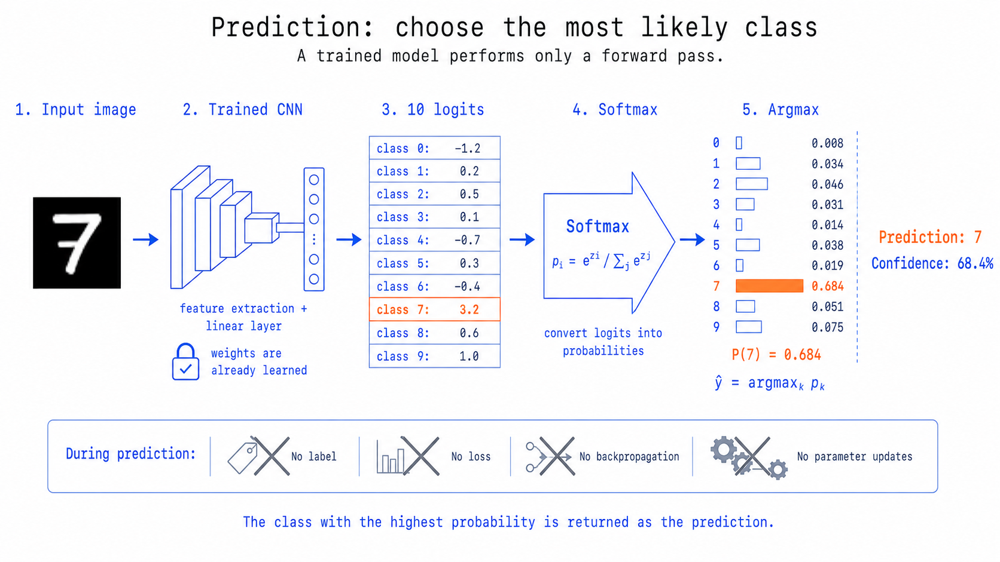

# 用 CNN 识别手写数字 0–9

这是一个面向课堂讲解的最小 PyTorch 示例。模型只有两个卷积层，方便把代码和卷积、ReLU、池化、全连接、Softmax、交叉熵及反向传播逐一对应起来。



## 1. 创建环境

建议使用 Python 3.11 或更新版本：

```bash
python3 -m venv .venv
source .venv/bin/activate
python -m pip install -r requirements.txt
```

## 2. 生成测试数字

```bash
python generate_test_digit.py
```

会生成 `examples/test_digit_7.png`。它是黑底白字、28×28 像素的手写风格数字 7。

## 3. 训练 CNN

```bash
python train.py --epochs 3
```

首次运行会下载 MNIST。训练完成后，最佳模型保存在 `checkpoints/mnist_cnn.pt`。CPU 通常几分钟即可完成；Apple Silicon 会自动使用 MPS。

## 4. 识别测试数字

```bash
python predict.py examples/test_digit_7.png --save-preprocessed examples/preprocessed.png
```

终端会输出预测数字、置信度和 0–9 的完整概率条形图。`--save-preprocessed` 可展示模型真正接收到的 28×28 图像。

也可以拍摄或绘制自己的数字（PNG/JPEG 均可）：

```bash
python predict.py path/to/my_digit.png
```

预测脚本会自动处理白纸黑字/黑底白字，并裁剪、缩放、居中，使输入尽量接近 MNIST。

### 按课堂流程逐步运行

```bash
python predict_step_by_step.py examples/test_digit_7.png
```

这个脚本把代码逐步对应到课堂中的完整预测流程，并打印每一步的张量形状：

```text
28 x 28 pixel matrix                  [1, 1, 28, 28]
  -> Convolution                      [1, 16, 28, 28]
  -> ReLU                             [1, 16, 28, 28]
  -> Pooling                          [1, 16, 14, 14]
  -> More convolution                 [1, 32, 14, 14]
  -> Second ReLU                      [1, 32, 14, 14]
  -> Second pooling                   [1, 32, 7, 7]
  -> Flatten                          [1, 1568]
  -> Linear layer                     [1, 10]
  -> Softmax                          [1, 10]
  -> Prediction                       one class (0–9)
```

课件里的 “More convolution” 是简化表达；在实际代码中，它是第二个
`Convolution -> ReLU -> Pooling` 模块。

## 课堂讲解顺序

1. `model.py`：逐层跟踪张量形状，讲卷积、ReLU 和池化。
2. `train.py`：讲“前向计算 → 损失 → 反向传播 → 参数更新”。
3. `image_utils.py`：说明真实输入与训练数据分布必须一致。
4. `predict.py`：讲 logits、Softmax、预测类别和置信度。

`examples/` 还包含卷积局部感受野、16/32 个特征图、ReLU 前后、池化前后、Flatten、全连接层和 Softmax 等课堂配图。

张量形状变化：

```text
[B, 1, 28, 28]
  -> Conv/ReLU/Pool -> [B, 16, 14, 14]
  -> Conv/ReLU/Pool -> [B, 32, 7, 7]
  -> Flatten/Linear -> [B, 10]
```
